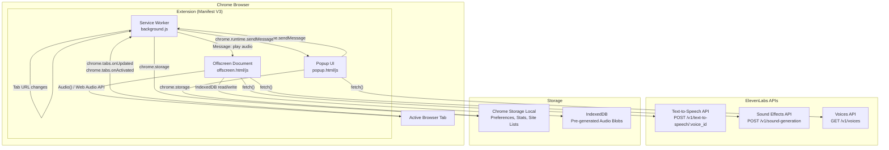
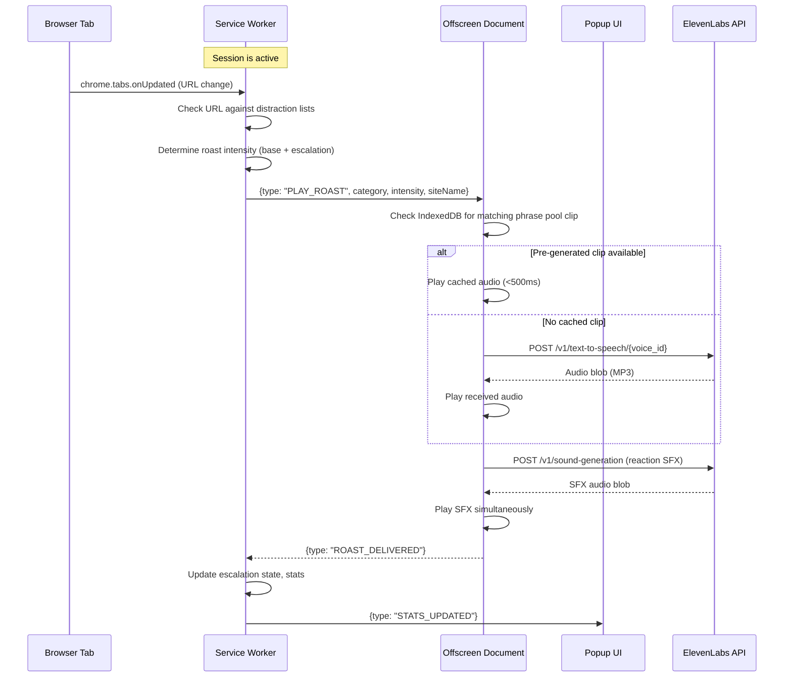

# Design Document: Work Bestie

## Overview

Work Bestie is a Chrome Manifest V3 browser extension that acts as a GenZ-personality focus buddy. It monitors browsing activity during focus sessions and uses ElevenLabs voice AI to deliver humorous roasts, nudges, and sound effects when the user drifts to distraction websites.

The extension deeply integrates three ElevenLabs APIs:
- **Text-to-Speech API** (`/v1/text-to-speech/{voice_id}`) — for pre-generating phrase pools and on-the-fly dynamic nudges
- **Sound Effects API** (`/v1/sound-generation`) — for generating intensity-matched reaction SFX
- **Voices API** (`/v1/voices`) — for API key validation and voice listing

The architecture follows Chrome MV3 conventions: a background service worker handles tab monitoring and session logic, an offscreen document handles audio playback (since service workers cannot access the Audio API), and the popup UI provides session controls, stats, and settings.

### Key Design Decisions

1. **Offscreen Document for Audio**: Chrome MV3 service workers cannot play audio. We use an offscreen document with `AUDIO_PLAYBACK` reason to handle all TTS and SFX playback via the Web Audio API.
2. **Pre-generated Phrase Pool**: Common roasts are pre-generated as MP3 blobs and stored in IndexedDB (via the offscreen document) for sub-500ms playback. This avoids API latency for the most common scenarios.
3. **Dual TTS Strategy**: Pre-generated clips for instant response + on-the-fly ElevenLabs TTS for site-specific personalized nudges. Fallback from dynamic to pre-generated on API failure.
4. **Chrome Storage for State**: All user preferences, session stats, and site lists use `chrome.storage.local` for persistence. API key uses `chrome.storage.local` with the extension's sandboxed storage (Chrome extensions already isolate storage per-extension).
5. **Message-Passing Architecture**: All communication between service worker, popup, and offscreen document uses `chrome.runtime.sendMessage` / `onMessage`.

## Architecture

### High-Level Architecture Diagram



### Component Communication Flow



## Components and Interfaces

### 1. Service Worker (`background.js`)

The central coordinator. Manages session state, tab monitoring, escalation logic, and dispatches audio playback commands.

**Responsibilities:**
- Listen to `chrome.tabs.onUpdated` and `chrome.tabs.onActivated` for URL changes
- Match URLs against distraction site lists from Chrome Storage
- Manage session timers (countdown, elapsed, pomodoro cycles)
- Track escalation state per browsing episode
- Update badge color/text via `chrome.action.setBadgeBackgroundColor` / `setBadgeText`
- Persist session stats to Chrome Storage
- Create/manage the offscreen document lifecycle

**Key Interfaces:**

```typescript
// Messages sent FROM service worker
interface PlayRoastMessage {
  type: "PLAY_ROAST";
  category: DistractionCategory;
  intensity: RoastIntensity;
  siteName: string;       // for dynamic nudge text
  siteUrl: string;
  voicePreset: VoicePreset;
  volume: number;         // 0.0 - 1.0, escalation-adjusted
}

interface SessionStateMessage {
  type: "SESSION_STATE";
  state: SessionState;
}

// Messages received BY service worker
interface StartSessionMessage {
  type: "START_SESSION";
  mode: SessionMode;
}

interface StopSessionMessage {
  type: "STOP_SESSION";
}

interface RoastDeliveredMessage {
  type: "ROAST_DELIVERED";
  timestamp: number;
}
```

### 2. Offscreen Document (`offscreen.html` / `offscreen.js`)

Handles all audio operations since service workers cannot access the Audio API.

**Responsibilities:**
- Receive playback commands from service worker via message passing
- Look up pre-generated phrase pool clips from IndexedDB
- Call ElevenLabs TTS API for dynamic nudges when no cached clip matches
- Call ElevenLabs SFX API for reaction sound effects
- Play audio using `Audio()` elements or Web Audio API
- Manage IndexedDB for phrase pool storage
- Handle API failures with fallback to generic cached clips

**Key Interfaces:**

```typescript
// Offscreen document message handler
interface PlayRoastCommand {
  type: "PLAY_ROAST";
  category: DistractionCategory;
  intensity: RoastIntensity;
  siteName: string;
  voicePreset: VoicePreset;
  volume: number;
}

interface PreGeneratePhrasesCommand {
  type: "PRE_GENERATE_PHRASES";
  apiKey: string;
  voicePreset: VoicePreset;
}

// ElevenLabs TTS API call
async function generateTTS(text: string, voiceId: string, apiKey: string): Promise<Blob> {
  const response = await fetch(
    `https://api.elevenlabs.io/v1/text-to-speech/${voiceId}?output_format=mp3_44100_128`,
    {
      method: "POST",
      headers: {
        "xi-api-key": apiKey,
        "Content-Type": "application/json",
      },
      body: JSON.stringify({
        text,
        model_id: "eleven_multilingual_v2",
        voice_settings: { stability: 0.5, similarity_boost: 0.75, style: 0.3 },
      }),
    }
  );
  return response.blob();
}

// ElevenLabs SFX API call
async function generateSFX(description: string, apiKey: string): Promise<Blob> {
  const response = await fetch(
    "https://api.elevenlabs.io/v1/sound-generation",
    {
      method: "POST",
      headers: {
        "xi-api-key": apiKey,
        "Content-Type": "application/json",
      },
      body: JSON.stringify({
        text: description,
        duration_seconds: 2.0,
        prompt_influence: 0.5,
      }),
    }
  );
  return response.blob();
}
```

### 3. Popup UI (`popup.html` / `popup.js` / `popup.css`)

The main user interface rendered when clicking the extension icon.

**Responsibilities:**
- Display onboarding flow for first-time users
- Show session controls (start/stop, mode selection)
- Display timer (countdown or elapsed)
- Show stats dashboard (focus time, distractions, streak)
- Provide settings panel (voice, intensity, site lists, API key)
- Communicate with service worker for session management

**Views:**
- **Onboarding View**: Multi-step personality quiz (voice → intensity → session type)
- **Main View**: Session controls + timer + quick stats
- **Stats View**: Full stats dashboard
- **Settings View**: Voice preset, intensity slider, site list editor, API key management

```typescript
// Popup communicates with service worker
function sendToBackground(message: object): Promise<any> {
  return chrome.runtime.sendMessage(message);
}

// Listen for state updates from service worker
chrome.runtime.onMessage.addListener((message) => {
  switch (message.type) {
    case "SESSION_STATE":
      updateSessionUI(message.state);
      break;
    case "STATS_UPDATED":
      updateStatsUI(message.stats);
      break;
    case "TIMER_TICK":
      updateTimerDisplay(message.remaining || message.elapsed);
      break;
  }
});
```

### 4. Tab Monitor Module (within Service Worker)

**Responsibilities:**
- Register listeners for `chrome.tabs.onUpdated` and `chrome.tabs.onActivated`
- Extract domain from tab URL
- Match domain against distraction site lists
- Debounce rapid tab switches (ignore changes within 500ms)
- Report distraction detection to session manager

```typescript
function extractDomain(url: string): string | null {
  try {
    return new URL(url).hostname.replace(/^www\./, "");
  } catch {
    return null;
  }
}

function isDistractionSite(domain: string, siteListsByCategory: SiteListMap): DistractionMatch | null {
  for (const [category, domains] of Object.entries(siteListsByCategory)) {
    if (domains.some(d => domain === d || domain.endsWith(`.${d}`))) {
      return { category: category as DistractionCategory, domain };
    }
  }
  return null;
}
```

### 5. Session Manager Module (within Service Worker)

**Responsibilities:**
- Manage session lifecycle (start, tick, pause, resume, stop)
- Handle pomodoro work/break interval switching
- Track elapsed/remaining time via `chrome.alarms` API (service workers can't use `setInterval` reliably)
- Generate session summaries on completion

```typescript
// Use chrome.alarms for reliable timing in service worker
chrome.alarms.create("session-tick", { periodInMinutes: 1 / 60 }); // ~1 second ticks

chrome.alarms.onAlarm.addListener((alarm) => {
  if (alarm.name === "session-tick") {
    handleSessionTick();
  }
});
```

### 6. Escalation Manager Module (within Service Worker)

**Responsibilities:**
- Track time spent on current distraction site
- Determine escalation level based on elapsed time (0s → base, 30s → +1, 60s → savage)
- Calculate volume multiplier per escalation step
- Reset escalation when user navigates away

```typescript
interface EscalationState {
  currentSiteUrl: string | null;
  firstRoastTimestamp: number | null;
  escalationLevel: 0 | 1 | 2;  // 0=base, 1=+1 intensity, 2=savage
  roastsDelivered: number;
}

function getEscalatedIntensity(baseIntensity: RoastIntensity, escalationLevel: number): RoastIntensity {
  const levels: RoastIntensity[] = ["soft", "medium", "savage"];
  const baseIndex = levels.indexOf(baseIntensity);
  const escalatedIndex = Math.min(baseIndex + escalationLevel, 2);
  return levels[escalatedIndex];
}

function getEscalatedVolume(baseVolume: number, escalationLevel: number): number {
  return Math.min(baseVolume + escalationLevel * 0.2, 1.0);
}
```


## Data Models

### User Preferences (Chrome Storage)

```typescript
interface UserPreferences {
  onboardingComplete: boolean;
  voicePreset: VoicePreset;       // "male" | "female"
  roastIntensity: RoastIntensity; // "soft" | "medium" | "savage"
  defaultSessionMode: SessionMode;
  apiKey: string;                 // ElevenLabs API key
  apiKeyValidated: boolean;
}

type VoicePreset = "male" | "female";
type RoastIntensity = "soft" | "medium" | "savage";
type SessionMode = "open-focus" | "1-hour" | "2-hour" | "pomodoro";
```

### Voice Preset Configuration

```typescript
// Maps voice presets to ElevenLabs voice IDs
const VOICE_CONFIG: Record<VoicePreset, { voiceId: string; name: string }> = {
  female: { voiceId: "EXAVITQu4vr4xnSDxMaL", name: "Bella" },  // Example GenZ female voice
  male: { voiceId: "pNInz6obpgDQGcFmaJgB", name: "Adam" },     // Example GenZ male voice
};
```

### Distraction Site Lists (Chrome Storage)

```typescript
type DistractionCategory = "social-media" | "entertainment" | "news" | "gaming" | "shopping" | "custom";

type SiteListMap = Record<DistractionCategory, string[]>;

// Default distraction site lists
const DEFAULT_SITE_LISTS: SiteListMap = {
  "social-media": [
    "facebook.com", "instagram.com", "twitter.com", "x.com",
    "tiktok.com", "snapchat.com", "reddit.com", "threads.net",
    "linkedin.com/feed", "bsky.app"
  ],
  "entertainment": [
    "youtube.com", "netflix.com", "twitch.tv", "hulu.com",
    "disneyplus.com", "spotify.com", "soundcloud.com", "hbomax.com"
  ],
  "news": [
    "cnn.com", "bbc.com", "foxnews.com", "nytimes.com",
    "theguardian.com", "buzzfeed.com", "huffpost.com"
  ],
  "gaming": [
    "store.steampowered.com", "epicgames.com", "roblox.com",
    "miniclip.com", "poki.com", "chess.com", "lichess.org"
  ],
  "shopping": [
    "amazon.com", "ebay.com", "etsy.com", "walmart.com",
    "target.com", "aliexpress.com", "shein.com", "temu.com"
  ],
  "custom": [],
};
```

### Session State

```typescript
interface SessionState {
  isActive: boolean;
  mode: SessionMode;
  startTimestamp: number;           // Date.now() when session started
  elapsedMs: number;                // total elapsed focus time in ms
  remainingMs: number | null;       // null for open-focus
  isPomodoroBreak: boolean;         // true during pomodoro break intervals
  pomodoroWorkMs: number;           // 25 * 60 * 1000
  pomodoroBreakMs: number;          // 5 * 60 * 1000
  currentIntervalStartMs: number;   // start of current work/break interval
  distractionsThisSession: number;
}

interface SessionSummary {
  mode: SessionMode;
  totalFocusTimeMs: number;
  distractionsCaught: number;
  startTimestamp: number;
  endTimestamp: number;
  pomodoroIntervalsCompleted: number; // 0 for non-pomodoro
}
```

### Stats (Chrome Storage)

```typescript
interface Stats {
  totalFocusTimeMs: number;         // cumulative across all sessions
  totalDistractionsCaught: number;  // cumulative
  currentStreak: number;            // consecutive days with ≥1 session
  lastSessionDate: string;          // ISO date string "YYYY-MM-DD"
  sessionsCompleted: number;
}
```

### Phrase Pool (IndexedDB)

```typescript
interface PhrasePoolEntry {
  id: string;                       // unique ID
  category: DistractionCategory;
  intensity: RoastIntensity;
  text: string;                     // the roast text
  voicePreset: VoicePreset;
  audioBlob: Blob;                  // pre-generated MP3 audio
  createdAt: number;
}

// IndexedDB schema: database "work-bestie-audio", object store "phrases"
// Index on [category, intensity, voicePreset] for efficient lookup
```

### Escalation State (In-Memory, Service Worker)

```typescript
interface EscalationState {
  currentDistractionDomain: string | null;
  firstRoastTimestamp: number | null;
  escalationLevel: 0 | 1 | 2;
  roastsDelivered: number;
  baseVolume: number;
}
```

### Roast Text Templates

```typescript
interface RoastTemplate {
  category: DistractionCategory;
  intensity: RoastIntensity;
  templates: string[];  // Use {site} placeholder for dynamic site name insertion
}

// Example templates for dynamic nudge generation
const ROAST_TEMPLATES: RoastTemplate[] = [
  {
    category: "social-media",
    intensity: "soft",
    templates: [
      "Bestie, {site} can wait. You got this!",
      "Hmm, {site} again? Let's get back to work, babe.",
    ],
  },
  {
    category: "social-media",
    intensity: "savage",
    templates: [
      "Bro, you're on {site} AGAIN? This is giving unemployed energy fr fr.",
      "Not you doom-scrolling {site} when you literally have work to do. Embarrassing.",
    ],
  },
  // ... more templates per category × intensity
];
```

### SFX Descriptions by Intensity

```typescript
const SFX_DESCRIPTIONS: Record<RoastIntensity, string[]> = {
  soft: [
    "gentle notification chime, soft and friendly",
    "light bubble pop sound, subtle and pleasant",
  ],
  medium: [
    "sad trombone wah wah sound effect, comedic",
    "comedic fail buzzer sound, playful",
  ],
  savage: [
    "loud airhorn blast, dramatic and attention-grabbing",
    "dramatic orchestral sting, intense and shocking",
  ],
};
```

### Chrome Storage Key Map

```typescript
// All chrome.storage.local keys used by the extension
const STORAGE_KEYS = {
  PREFERENCES: "work-bestie-preferences",
  SITE_LISTS: "work-bestie-site-lists",
  STATS: "work-bestie-stats",
  SESSION_STATE: "work-bestie-session",
  ONBOARDING_STEP: "work-bestie-onboarding-step",
} as const;
```

### Manifest V3 Configuration

```json
{
  "manifest_version": 3,
  "name": "Work Bestie",
  "version": "1.0.0",
  "description": "Your GenZ work buddy that roasts you back to focus 💅",
  "permissions": [
    "tabs",
    "activeTab",
    "storage",
    "alarms",
    "offscreen"
  ],
  "background": {
    "service_worker": "background.js"
  },
  "action": {
    "default_popup": "popup.html",
    "default_icon": {
      "16": "icons/icon16.png",
      "48": "icons/icon48.png",
      "128": "icons/icon128.png"
    }
  },
  "icons": {
    "16": "icons/icon16.png",
    "48": "icons/icon48.png",
    "128": "icons/icon128.png"
  },
  "host_permissions": [
    "https://api.elevenlabs.io/*"
  ]
}
```


## Correctness Properties

*A property is a characteristic or behavior that should hold true across all valid executions of a system — essentially, a formal statement about what the system should do. Properties serve as the bridge between human-readable specifications and machine-verifiable correctness guarantees.*

### Property 1: Preferences round-trip persistence

*For any* valid `UserPreferences` object (any combination of `VoicePreset`, `RoastIntensity`, `SessionMode`, and non-empty API key string), serializing to Chrome Storage and deserializing back should produce an equivalent object.

**Validates: Requirements 1.5, 9.2, 9.3, 11.4**

### Property 2: Onboarding step resume

*For any* onboarding step index (1 through N), if the step is persisted to Chrome Storage and the onboarding flow is re-initialized, the flow should resume at exactly that step index.

**Validates: Requirements 1.7**

### Property 3: Session summary accuracy

*For any* session mode, start timestamp, elapsed time, and distraction count, when a session ends (by timer expiry or manual stop), the produced `SessionSummary` should have `totalFocusTimeMs` equal to the tracked elapsed time and `distractionsCaught` equal to the tracked distraction count.

**Validates: Requirements 2.7, 2.8**

### Property 4: Non-distraction URL passthrough

*For any* domain string that does not appear in any distraction category list (and is not a subdomain of any listed domain), `isDistractionSite` should return `null`.

**Validates: Requirements 3.4**

### Property 5: Site list add/remove round-trip

*For any* valid domain string and any distraction category, adding the domain to the category's list and then querying the list should include that domain; subsequently removing it and querying should not include it.

**Validates: Requirements 4.2, 4.3**

### Property 6: Custom category default assignment

*For any* valid domain string added without specifying a category, the domain should appear in the "custom" distraction category and in no other category (unless it was previously added to another).

**Validates: Requirements 4.4**

### Property 7: Invalid URL rejection

*For any* string that does not match a valid domain pattern (e.g., contains spaces, no TLD, empty string, special characters only), the URL validator should return false and the site list should remain unchanged after the attempted addition.

**Validates: Requirements 4.5**

### Property 8: Phrase pool clip selection correctness

*For any* distraction category and roast intensity, when the phrase pool contains clips for that combination, the selected clip's `category` and `intensity` fields should match the requested category and intensity.

**Validates: Requirements 5.3**

### Property 9: TTS request construction correctness

*For any* combination of `VoicePreset` and `RoastIntensity`, the TTS request builder should produce a request with the `voice_id` matching the preset's configured ElevenLabs voice ID, and the text should be a non-empty string appropriate for the given intensity.

**Validates: Requirements 6.2**

### Property 10: Escalation intensity calculation

*For any* base `RoastIntensity` and escalation level (0, 1, or 2), `getEscalatedIntensity(base, level)` should return an intensity that is at least as severe as the base, at most "savage", and monotonically non-decreasing with escalation level. At level 2, the result should always be "savage" regardless of base.

**Validates: Requirements 8.1, 8.2**

### Property 11: Escalation state reset

*For any* `EscalationState` (any escalation level, any number of roasts delivered, any timestamp), resetting the state should produce `escalationLevel: 0`, `firstRoastTimestamp: null`, `roastsDelivered: 0`, and `currentDistractionDomain: null`.

**Validates: Requirements 8.3**

### Property 12: Escalation volume monotonicity

*For any* base volume (0.0–1.0) and escalation levels 0, 1, 2, `getEscalatedVolume(base, level)` should return values that are monotonically non-decreasing with level and capped at 1.0.

**Validates: Requirements 8.4**

### Property 13: Settings change preserves active session

*For any* active `SessionState` and any valid settings change (voice preset, intensity, or session mode), applying the settings change should not modify `isActive`, `elapsedMs`, `startTimestamp`, or `distractionsThisSession`.

**Validates: Requirements 9.4**

### Property 14: Streak calculation correctness

*For any* sequence of session completion dates (as ISO date strings), the streak counter should equal the length of the longest suffix of consecutive calendar days ending at the most recent date.

**Validates: Requirements 10.3**

### Property 15: Stats accumulation correctness

*For any* existing `Stats` object and any `SessionSummary`, updating stats should produce `totalFocusTimeMs` equal to the old value plus the summary's `totalFocusTimeMs`, and `totalDistractionsCaught` equal to the old value plus the summary's `distractionsCaught`.

**Validates: Requirements 10.4**

### Property 16: API key masking

*For any* non-empty API key string of length ≥ 8, the masked output should show the first 4 characters, asterisks for the middle, and the last 4 characters. For strings shorter than 8 characters, the entire string should be masked with asterisks.

**Validates: Requirements 11.5**

### Property 17: Badge color determination

*For any* combination of `isSessionActive` (boolean) and `isOnDistractionSite` (boolean), the badge color function should return: no badge when session is inactive, green when session is active and not on a distraction site, red when session is active and on a distraction site.

**Validates: Requirements 12.1**

## Error Handling

### API Failures

| Scenario | Handling |
|---|---|
| TTS API timeout (>5s) | Fall back to pre-generated phrase pool clip for the detected category |
| TTS API error (4xx/5xx) | Fall back to pre-generated phrase pool clip; log error silently |
| SFX API failure | Skip SFX playback; deliver roast audio only |
| API key invalid (401/403) | Show error in popup; disable session start until key is updated |
| Network offline | Use only pre-generated phrase pool clips; skip dynamic nudges and SFX |

### Extension Errors

| Scenario | Handling |
|---|---|
| Offscreen document creation fails | Retry once; if still fails, show error in popup |
| IndexedDB unavailable | Fall back to in-memory phrase pool (reduced set) |
| Chrome Storage write fails | Retry with exponential backoff (max 3 attempts); show error if persistent |
| Tab URL parsing fails | Ignore the tab event; do not trigger distraction detection |
| Audio playback fails | Log error; continue session without audio for that event |

### Session Edge Cases

| Scenario | Handling |
|---|---|
| User closes all browser windows during session | Service worker persists session state to storage; resume on next browser open |
| Service worker killed by Chrome | Use `chrome.alarms` for timer persistence; restore state from storage on wake |
| Multiple rapid tab switches (<500ms) | Debounce: only process the last URL after 500ms of stability |
| Same distraction site reopened after navigating away | Reset escalation state; treat as new browsing episode |

## Testing Strategy

### Property-Based Tests (fast-check)

The extension's pure logic functions are well-suited for property-based testing using [fast-check](https://github.com/dubzzz/fast-check) (JavaScript PBT library).

**Configuration:**
- Minimum 100 iterations per property test
- Each test tagged with: `Feature: work-bestie, Property {N}: {title}`
- Run via: `npx vitest --run`

**Testable modules (pure functions):**
- `isDistractionSite(domain, siteListMap)` — URL matching logic
- `getEscalatedIntensity(base, level)` — escalation intensity calculation
- `getEscalatedVolume(base, volume)` — escalation volume calculation
- `resetEscalation(state)` — escalation state reset
- `calculateStreak(dates)` — streak calculation
- `updateStats(stats, summary)` — stats accumulation
- `maskApiKey(key)` — API key masking
- `getBadgeColor(isActive, isDistraction)` — badge color determination
- `validateDomain(input)` — URL/domain validation
- `selectPhrasePoolClip(pool, category, intensity)` — clip selection
- `buildTTSRequest(text, voicePreset, intensity)` — TTS request construction
- `createSessionSummary(state)` — session summary generation
- `serializePreferences(prefs)` / `deserializePreferences(data)` — preferences round-trip

### Unit Tests (vitest)

Example-based tests for specific scenarios:
- Onboarding flow step rendering and navigation
- Session mode initialization (correct timer values per mode)
- Pomodoro work/break interval transitions
- API key validation flow (success and failure paths)
- TTS API fallback on failure
- SFX intensity-to-description mapping
- Badge clearing when no session is active

### Integration Tests

- Chrome Storage read/write operations
- Offscreen document creation and message passing
- Tab monitoring event listener registration
- ElevenLabs API calls with mocked responses (TTS, SFX, Voices)
- Audio playback via offscreen document
- End-to-end: distraction detection → roast delivery pipeline

### Manual Testing

- Audio quality and timing (SFX before/simultaneous with roast)
- Onboarding UX flow
- Popup UI responsiveness and visual polish
- Cross-site distraction detection timing (<2 seconds)
- Escalation feel (volume increase, intensity progression)
